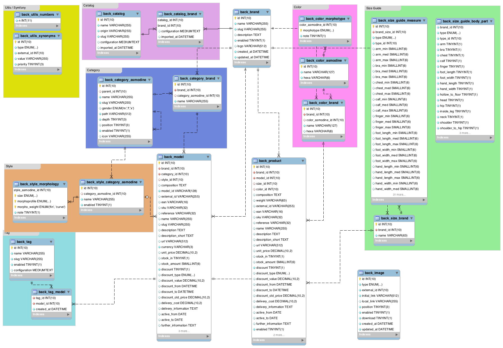
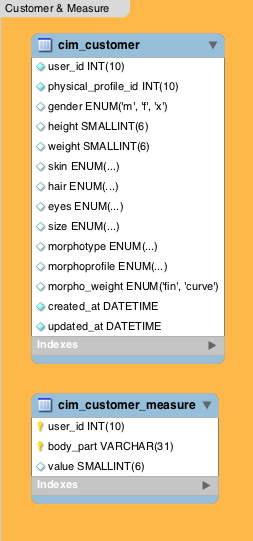
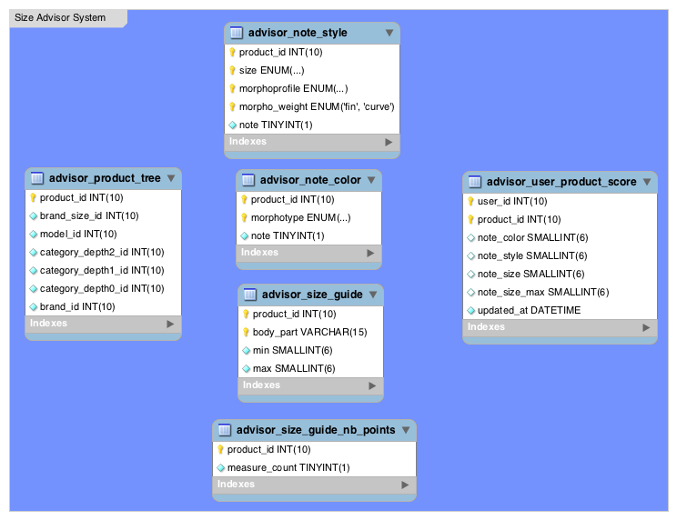

# Asmodine BackOffice

The *Asmodine BackOffice* project includes:
 
 - **AdminBundle**: The administration interface associated with the PIM
 - **SizeAdvisorBundle**: The Size Advisor System
 - **CustomerBundle**: Customers & Measurements

## Documentation FR

 - [Lancement rapide](README_FR.md)
 - [AdminBundle](src/Asmodine/AdminBundle/Resources/doc/fr/index.md)
   - Import des catalogues
   - MAJ Des produits
   - Interface graphique d'administration
   - Gestion des styles
   - Gestion du guide des tailles
   - Gestion des catégories
 - [CustomerBundle](src/Asmodine/CustomerBundle/Resources/doc/fr/index.md)
   - API Utilisateur Front
   - Données des utilisateurs
 - [SizeAdvisorBundle](src/Asmodine/SizeAdvisorBundle/Resources/doc/fr/index.md)
   - Extraction du guide des tailles par produit
   - Calcul des notes par produit
   - Calcul des notes produits/utilisateurs


## Elasticsearch


Command to execute

```
PUT _all/_settings?preserve_existing=true
{
  "index.max_result_window" : "1000000"
}
```
 
## Database

### DB Schemas

 
 
 

**Note:** This schema does not include temporary tables.

### DB Views

Unassociated categories :

```mysql
SELECT cb.id, b.name AS marque, cb.name as categorie_non_associee, m.name AS modele_nom, p.name AS produit_nom, m.url AS model_url, p.url AS produit_url FROM back_category_brand AS cb JOIN back_brand AS b ON cb.brand_id = b.id JOIN back_model AS m ON cb.id = m.category_id JOIN back_product AS p ON p.model_id = m.id WHERE cb.category_asmodine_id IS NULL;
```

Unassociated colors :

```mysql
SELECT c.id, c.name AS couleur_non_associee, b.name AS marque, m.name AS modele_nom, p.name AS produit_nom, m.url AS model_url, p.url AS produit_url FROM back_color_brand AS c JOIN back_product AS p ON p.color_id = c.id JOIN back_model AS m ON p.model_id = m.id JOIN back_brand AS b ON m.brand_id = b.id WHERE c.color_asmodine_id IS NULL;
```

Unassociated styles :

```mysql
SELECT b.name AS brand_name, m.name AS model_name, m.description, COALESCE(m.url, p.url) AS url FROM  back_model AS m JOIN back_product AS p ON p.model_id = m.id JOIN back_brand AS b on p.brand_id = b.id WHERE m.style_id IS NULL GROUP BY m.id;
```

Size guide (with no default value) : 

```mysql
SELECT
    sb.id,
    b.name AS brand_name,
    ca.path AS category_path,
    sb.name AS brand_size_name,
    count(p.id) AS nb_products,
    sgb.arm, sgm.arm_min, sgm.arm_med, sgm.arm_max, sgb.bra, sgm.bra_min, sgm.bra_med, sgm.bra_max, sgb.chest, sgm.chest_min, sgm.chest_med, sgm.chest_max, sgb.calf, sgm.calf_min, sgm.calf_med, sgm.calf_max, sgb.finger, sgm.finger_min, sgm.finger_med, sgm.finger_max, sgb.foot_length, sgm.foot_length_min, sgm.foot_length_med, sgm.foot_length_max, sgb.foot_width, sgm.foot_width_min, sgm.foot_width_med, sgm.foot_width_max, sgb.hand_length, sgm.hand_length_min, sgm.hand_length_med, sgm.hand_length_max, sgm.hand_width_min, sgm.hand_width_med, sgm.hand_width_max, sgb.hollow_to_floor, sgm.hollow_to_floor_min, sgm.hollow_to_floor_med, sgm.hollow_to_floor_max, sgb.head, sgm.head_min, sgm.head_med, sgm.head_max, sgb.hip, sgm.hip_min, sgm.hip_med, sgm.hip_max, sgb.inside_leg, sgm.inside_leg_min, sgm.inside_leg_med, sgm.inside_leg_max, sgb.neck, sgm.neck_min, sgm.neck_med, sgm.neck_max, sgb.shoulder, sgm.shoulder_min, sgm.shoulder_med, sgm.shoulder_max, sgb.shoulder_to_hip, sgm.shoulder_to_hip_min, sgm.shoulder_to_hip_med, sgm.shoulder_to_hip_max, sgb.thigh, sgm.thigh_min, sgm.thigh_med, sgm.thigh_max, sgb.waist, sgm.waist_min, sgm.waist_med, sgm.waist_max, sgb.wrist, sgm.wrist_min, sgm.wrist_med, sgm.wrist_max

FROM back_size_brand AS sb
	INNER JOIN back_brand AS b ON sb.brand_id = b.id
	INNER JOIN back_product AS p ON p.size_id = sb.id 
	INNER JOIN back_model AS m ON p.model_id = m.id 
	INNER JOIN back_category_brand AS cb ON m.category_id = cb.id
	INNER JOIN back_category_asmodine AS ca ON cb.category_asmodine_id = ca.id
	
	LEFT JOIN back_size_guide_measure AS sgm ON sgm.brand_size_id = sb.id AND sgm.type_id = ca.id AND sgm.type = 'category'
	LEFT JOIN back_size_guide_body_part AS sgb ON sgb.type_id = ca.id AND sgb.type = 'category'

GROUP BY sb.id, ca.id 
ORDER BY brand_name, brand_size_name
```

Size Guide Import :

```mysql
SELECT sgm.id, b.name AS brand_name, ca.path AS category_path, sb.name AS brand_size_name, sgm.arm_min, sgm.arm_med, sgm.arm_max, sgm.bra_min, sgm.bra_med, sgm.bra_max, sgm.chest_min, sgm.chest_med, sgm.chest_max, sgm.calf_min, sgm.calf_med, sgm.calf_max, sgm.finger_min, sgm.finger_med, sgm.finger_max, sgm.foot_length_min, sgm.foot_length_med, sgm.foot_length_max, sgm.foot_width_min, sgm.foot_width_med, sgm.foot_width_max, sgm.hand_length_min, sgm.hand_length_med, sgm.hand_length_max, sgm.hand_width_min, sgm.hand_width_med, sgm.hand_width_max, sgm.hollow_to_floor_min, sgm.hollow_to_floor_med, sgm.hollow_to_floor_max, sgm.head_min, sgm.head_med, sgm.head_max, sgm.hip_min, sgm.hip_med, sgm.hip_max, sgm.inside_leg_min, sgm.inside_leg_med, sgm.inside_leg_max, sgm.neck_min, sgm.neck_med, sgm.neck_max, sgm.shoulder_min, sgm.shoulder_med, sgm.shoulder_max, sgm.shoulder_to_hip_min, sgm.shoulder_to_hip_med, sgm.shoulder_to_hip_max, sgm.thigh_min, sgm.thigh_med, sgm.thigh_max, sgm.waist_min, sgm.waist_med, sgm.waist_max, sgm.wrist_min, sgm.wrist_med, sgm.wrist_max

FROM back_size_guide_measure AS sgm 
INNER JOIN back_size_brand AS sb ON sgm.brand_size_id = sb.id
INNER JOIN back_brand AS b ON sb.brand_id = b.id
INNER JOIN back_category_asmodine AS ca ON sgm.type_id = ca.id AND sgm.type = 'category'

ORDER BY brand_name, category_path, brand_size_name
```