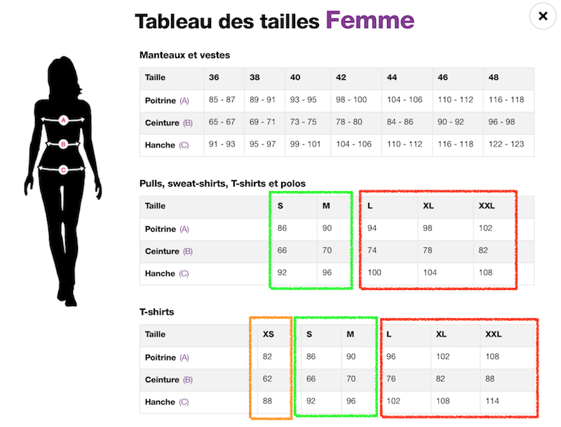

# Fixtures

## Styles et Catégories

### Généralités

Ce qui concerne les styles et les catégories se trouvent dans le dossier 
[/src/Asmodine/AdminBundle/DataFixtures/fixtures/fr](../../../DataFixtures/fixtures/fr).
Les données sont au format YAML :
 - [http://yaml.org/](http://yaml.org/)
 - [https://symfony.com/doc/current/components/yaml/yaml_format.html](https://symfony.com/doc/current/components/yaml/yaml_format.html)

Les données sont "aplanies" avant d'êtres insérées en base.

Exemple : 

```yaml
# style.morphology.yml
"Femme":
    "Vêtements":
        "Jupes":
            "Portefeuille":
                fin:
                    small: { h: 2, o: 1, a: 2, v: 3, 8: 1, x: 1 }
                    tall:  { h: 2, o: 1, a: 2, v: 3, 8: 1, x: 1 }
                curve:
                    small: { h: 1, o: 1, a: 2, v: 3, 8: 1, x: 1 }
                    tall:  { h: 1, o: 1, a: 2, v: 3, 8: 1, x: 1 }
```

Cette partie du fichier est l'équivalent de 24 enregistrements en base comprenant les informations suivantes :
 - Style / "morpho weight" / taille / morphoprofile / note
 

### category.asmodine.yml

**Table : back_category_asmodine**

Le fichier [category.asmodine.yml](../../../DataFixtures/fixtures/fr/category.asmodine.yml) est un tableau des catégories Asmodine.
Les données sont structurées de la manière suivante : 

```yaml
# category.asmodine.yml
- 
    name: "Nom de la catégorie"
    icon: "Nom (lien) de l'image associée) ou de la class css" # facultatif
    position: 1 # Ordre d'apparition (faculatatif)
    gender: 'w' # Genre (Facultatif pour les sous-catégories)
    parent: 'slug_categorie_superieur' # obligatoire pour les sous catégories
    description: 'description de la catégorie' # fortement recommandé pour les sous catégories 
```

**Note** : Il existe une catégorie et un genre "poubelle" appelé *nobody*. Cette catégorie est utilisée pour trier les catégories des marques qui ne sont pas gérer par Asmodine comme les meubles ou les vêtements enfants.

Les synonymes de cette catégorie permettent la détection des produits non désirés.

### color.asmodine.yml

**Table : back_color_asmodine**

Le fichier [color.asmodine.yml](../../../DataFixtures/fixtures/fr/color.asmodine.yml) est un tableau simple comprenant le nom de la couleur et l'héxadécimal associé. 

```yaml
# color.asmodine.yml
-
    name: 'Blanc'
    hexa: '#ffffff'
```


### color.morphotype.yml

**Table : back_color_morphotype**

Le fichier [color.morphotype.yml](../../../DataFixtures/fixtures/fr/color.morphotype.yml) permet l'association des couleurs Asmodine au morphotype en y ajoutant une note.
Les couleurs doivent être équivalentes à celles présentes dans le fichier [color.asmodine.yml](../../DataFixtures/fixtures/color.asmodine.yml).

```yaml
# color.morphotype.yml
"Blanc":
    asmoclear: 1
    asmonude: 2
    asmogold: 2
    asmosilver: 3
    asmodark: 3
```


### style.asmodine.yml

**Table : back_style_category_asmodine**

Le fichier [style.asmodine.yml](../../../DataFixtures/fixtures/fr/style.asmodine.yml) ajoute les styles associés aux catégories Asmodine.

```yaml
# style.asmodine.yml
"Femme":
    "Vêtements":
        "Jupes":
            - "Portefeuille"
            - "Plissées"
            - "Moulantes"
            - "Patineuses"
```


### style.morphology.yml

**Table : back_style_morphology**

Le fichier [style.morphology.yml](../../../DataFixtures/fixtures/fr/style.morphology.yml) associe chaque style à chaque morphology en y ajoutant une note.

```yaml
# style.morphology.yml
"Femme":
    "Vêtements":
        "Jupes":
            "Portefeuille":
                fin:
                    small: { h: 2, o: 1, a: 2, v: 3, 8: 1, x: 1 }
                    tall:  { h: 2, o: 1, a: 2, v: 3, 8: 1, x: 1 }
                curve:
                    small: { h: 1, o: 1, a: 2, v: 3, 8: 1, x: 1 }
                    tall:  { h: 1, o: 1, a: 2, v: 3, 8: 1, x: 1 }
```

## Synonymes

### synonym.yml

Les synonymes permettent d'associer certains éléments (catégories, styles, couleurs).

Les fichiers suivants ajoutent des tableaux de synonymes afin de pouvoir créer ces associations.
Ils ont été séparés pour une meilleure lisibilité :
 - [synonym.category.yml](../../../DataFixtures/PHP/fr/synonym.category.yml) 
 - [synonym.color.yml](../../../DataFixtures/PHP/fr/synonym.color.yml) 
 - [synonym.style.yml](../../../DataFixtures/PHP/fr/synonym.style.yml) 

Le premier niveau correspond à l'entité :
- category
- style
- color

Ensuite les niveaux varient selon l'entité (pour retrouver l'entité sans utiliser l'id MySQL et pour éviter les conflits) :
- Catégorie :
  - *path* de la catégorie Asmodine
  - Liste des synonymes
- Style :
  - *path* de la catégorie Asmodine
  - libellé du style
  - liste des synonymes
- Couleur :
  - nom de la couleur
  - liste des synonymes

Par défaut, les synonymes ont une priorité de 100. Comme le montre l'exemple ci-dessous, il est possible de modifier cette priorité ( entre 0 et 255) :

```yaml
color:
    "Rose":
        - { name: 'rose', priority: 0}
        - { name: 'pink', priority: 0}
    "Rose fushia":
        - rose fushia
        - fushia pink
```

**Note** : Le synonyme *vide* (ou '') permet de tout inclure.
Il est notamment utilisé pour les styles lorsqu'une catégorie ne possède qu'**un seul** style.

## Marques et Catalogues

### Généralités

Ce qui concerne les marques et catalogues se trouvent dans le dossier 
[/src/Asmodine/AdminBundle/DataFixtures/PHP/fr](../../../DataFixtures/PHP/fr).


### brand.yml

Le fichier [brand.yml](../../../DataFixtures/PHP/fr/brand.yml) liste les différentes marques en y incluant simplement une description et un lien vers le logo de la marque.


### catalog.config.yml

Le fichier [catalog.config.yml](../../../DataFixtures/PHP/fr/catalog.config.yml) permet de télécharger un catalogue et de le formater dans un format utilisable par Asmodine.

**Important** : Ce fichier ne permet pas l'association catalogue <=> marque !

#### Hiérarchie
Un catalogue est configuré de la manière suivante :

- **Niveau 0 :** Affiliation ('Awin', 'Effiliation' ou 'Tradedoubler')
- **Niveau 1 :** Nom du catalogue
- **Niveau 2 :** Configuration :
  - Awin : advertisers *(spécifique Awin)*, model, columns
  - Effiliation : reference *(spécifique Effiliation)*, model, columns
  - Tradedoubler : myFeed *(spécifique Tradedoubler)*, myFormat *(spécifique Tradedoubler)*, model, columns
  
#### Spécificités services d'affiliation

Les valeurs des entrées suivantes sont à saisir en fonction des informations retournées par les services d'affiliation :
- advertisers (Spécifique Awin)
- reference (Spécifique Effiliation)
- myFeed (Spécifique Tradedoubler)
- myFormat (Spécifique Tradedoubler)

#### Model
  
**Model** est un booléen. Il doit être à :
 - **true** si une ligne représente un modèle (inclus plusieurs tailles et/ou couleurs)
 - **false** si une ligne représente un produit (une seule taille et couleur par ligne)
 
#### Columns
 
**Columns** est un tableau qui doit être complété au maximum. Les clefs sont listées dans ce fichier :
[/src/Asmodine/AdminBundle/Model/Catalog/Configuration/Column/Asmodine.php](../../../Model/Catalog/Configuration/Column/Asmodine.php).
Il s'agit de toutes les constantes ne commençant pas par TYPE_*.

Columns peut prendre les valeurs suivantes :
- Valeur de l'entête du CSV :
```yaml
    external_id: aw_product_id
    ean: ean
    model_id: model_number
    name: product_name
```

- Chaine de caractères (*type: string*) la valeur sera commune pour tous les modèles/produits :
```yaml
    currency: - { type: string, value: 'EUR'}
```

- Valeur interne d'un champ CSV (*type: inside*), la valeur de *column* correspond à la valeur de l'entête de la colonne, les valeurs *start* et *end* permettent d'encadrer la valeur recherchée :
```yaml
    composition:
        - { type: inside, column: fields, start: 'g:material:', end: ';' }
    size:
        - { type: inside, column: fields, start: 'g:size:', end: ';' }
    color:
        - { type: inside, column: fields, start: 'g:color:', end: ';' }
```

Il est également possible d'associer ces éléments.
L'exemple ci-dessous représente deux colonnes du CSV relié par le caractère ' > ' :

```yaml
category:
    - merchant_product_category_path
    - { type: string, value: ' > '}
    - merchant_product_second_category
```

### catalog.brand.yml

Le fichier [catalog.brand.yml](../../../DataFixtures/PHP/fr/catalog.brand.yml) permet de configurer l'association marque/catalogue.

#### Association

Chaque association doit comporter 3 valeurs :
- catalog
- brand
- configuration

Exemple:

```yaml
castaluna: # Nom de l'association
    catalog: la-redoute # slug du catalogue
    brand: castaluna # slug de la marque
    configuration:
        ...
```

#### Configuration

Actuellement la configuration se compose de filtres, séparateurs et actions.

##### simple_filter

Les filtres simple permettent de supprimer (ou ne garder que) certains modèles/produits du catalogue. (Voir [SimpleFilter.php](../../../Model/CatalogBrand/Configuration/SimpleFilter.php))

Exemple :
```yaml
simple_filter:
    Fille: # Nom du filtre
        { column: 'category', position: 'start', contents: ['Fille'], keep: false }
```
L'exemple ci-dessus indique qu'il faut supprimer (*keep: false*) tout ce qui commence (*position: 'start'*) par 'Fille' (*contents: ['Fille']*) dans la colonne 'category' (*column: 'category'*).

- **column** doit prendre l'une des valeurs des colonnes de type Asmodine ([Column/Asmodine.php](../../../Model/Catalog/Configuration/Column/Asmodine.php)).
- **position** peut prendre l'une des valeurs suivantes : start, middle, end, equal ;
- **contents** est un tableau de la ou des valeurs à rechercher ;
- **keep** est un booléen qui indique s'il faut garder ou supprimer les valeurs trouvées ;
- **glue** peut prendre la valeur *and* ou *or*. *glue* permet de définir si il faut inclure toutes les valeurs de *contents* ou une au minimum.

##### separator

Les séparateurs indiquent les caractères utilisés pour la concaténation des tailles et/ou des couleurs.

Exemple :
```yaml
    separator:
        size: ['.',';']
        color: [',',';']
```

##### action

Les actions génèrent des requêtes à effectuer sur le catalogue (Voir [Action.php](../../../Model/CatalogBrand/Configuration/Action.php)).

Exemple :

```yaml
    action:
        Delete_FR: { action: 'replace', column: 'size', contents: {'(FR)': ''} }
        Delete_QTE: { action: 'replace', column: 'size', contents: {'(quantité limitée)': ''} }
```

Une action doit comporter trois paramètres :
- **action** : action à réaliser (voir les constantes commençant par ACTION_* dans [Action.php](../../../Model/CatalogBrand/Configuration/Action.php)) 
- **column** : colonne sur laquelle l'action doit être réalisée (Nom des colonnes disponibles (constante ne commençant pas par TYPE_*) : [Column/Asmodine.php](../../../Model/Catalog/Configuration/Column/Asmodine.php))
- **content** : pour l'action *replace* : {'texte à remplacer': 'texte de remplacement'}

### size_guide.measure.yml

#### Généralités

Le fichier [size_guide.measure.yml](../../../DataFixtures/PHP/fr/size_guide.measure.yml) permet de définir le guide des tailles en fonction d'une marque, d'un libellé de taille et d'une catégorie.

**Important :** Ce fichier ne permet d'associer que les catégories. La BDD et la future interface graphique permettront d'associer également un guide des tailles pour tout une marque, un modèle ou un produit.


```yaml
desigual:       # Marque (slug)
    '/femme':   # Catégorie (path)
        '24':   # Libellé de la taille
            waist: [62] # Taille avec une seule valeur => un intervalle sera appliqué en BDD
            hip: [88]
        '25':
            waist: [64,66] # Taille avec un intervalle
            hip: [90,94]
```

Les parties du corps disponibles sont les suivantes :
- **arm** : Longueur du bras
- **bra** : Tour de dessous de poitrine
- **chest** : Tour de poitrine
- **calf** : Tour de mollet
- **finger** : Tour de doigt
- **foot_length** : Longueur du pied
- **foot_width** : Largeur du pied
- **hand_length** : Longueur de la main
- **hand_width** : Largeur de la main
- **head** : Tour de tête
- **hip** : Tour de hanche
- **hollow_to_floor** : Creux du cou au sol
- **inside_leg** : Longueur d'entrejambe
- **neck** : Tour de cou 
- **shoulder** : Largeur d'épaule
- **shoulder_to_hip** : Longueur de l'épaule à la hanche
- **thigh** : Tour de cuisse
- **waist** : Tour de taille
- **wrist** : Tour de poignet

#### Surcharge
Ce fichier permet de surcharger des valeurs. Dans l'image ci-dessous on peut voir dans le tableau que :
- (en vert) Les tailles S et M sont identique;
- (en orange) La taille XS n'apparaît pas que pour les T-shirts;
- (en rouge) Les tailles L, XL et XXL diffèrent.



Une des solutions consiste à utiliser les tailles XS, S et M le plus haut possible dans la hiérarchie et de surcharger les tailles L, XL et XXL pour une catégorie précise.
Ainsi, le système utilisera le même guide pour les tailles XS, S et M et différenciera les tailles L, XL et XXL uniquement pour les t-shirts.

```yaml
desigual:
    '/femme':
        'XS':
            chest: [82]
            waist: [62]
            hip: [88]
        'S':
            chest: [86]
            waist: [66]
            hip: [92]
        'M':
            chest: [90]
            waist: [70]
            hip: [96]
        'L':
            chest: [94]
            waist: [74]
            hip: [100]
        'XL':
            chest: [98]
            waist: [78]
            hip: [104]
        'XXL':
            chest: [102]
            waist: [82]
            hip: [108]
    '/femme/vetements/t-shirts-debardeurs':
        'L':
            chest: [96]
            waist: [76]
            hip: [102]
        'XL':
            chest: [102]
            waist: [82]
            hip: [108]
        'XXL':
            chest: [108]
            waist: [88]
            hip: [114]
```

### size_guide.body_part.yml

Le fichier [size_guide.body_part.yml](../../../DataFixtures/PHP/fr/size_guide.body_part.yml) permet d'associer pour chaque marque, les parties du corps utilisées pour le guide des tailles selon la catégorie.

Exemple : 

```yaml
marque_1:
    '/femme/vetements/jeans': [waist, inside_leg]
    '/femme/vetements/jogging': [waist, inside_leg]
    '/femme/vetements/chemises': [chest, hip, waist]
marque_2:
    '/femme/vetements/jeans': [waist]
    '/femme/vetements/jogging': [waist]
    '/femme/vetements/chemises': [chest]
```

